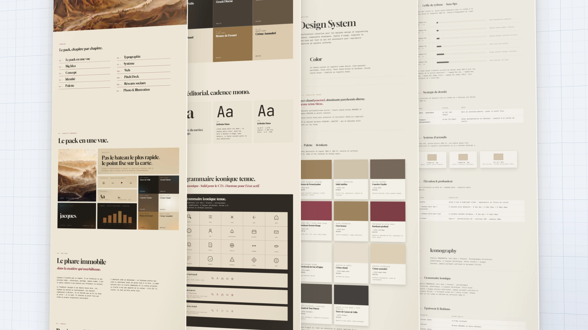

# Brand Identity Generator (BIG)



> **BIG** is a 12-step, AI-augmented and AI-accelerated Claude Code process that produces a complete, agency-grade brand identity from a company's strategic brief. The final deliverable is a pack including a brand book, a design system, a token catalog, a sign system (logo, iconography, data viz), and a photography & illustration direction.

[](LICENSE)

---

## Why BIG?

When teams use AI to create marketing assets today — websites, landing pages, slide decks, social posts — the dominant workflow is one-shot prompting. You hand the model a few strategic bullets about the company and ask it to generate the final asset directly. The model attempts, in a single leap, to translate brand strategy into visual choices.

That workflow fails in three predictable ways:

1. **The strategy-to-visual translation is shallow.** The model picks a palette, a font, a layout that *vaguely* fit the brief, but no individual choice is anchored in the strategy. Ask why the primary color is teal and you get a hallucinated rationale, not a real one.
2. **There is no shared visual ground.** Each asset is generated from scratch. The landing page, the deck, the LinkedIn carousel all start from the same prompt — and end up *visually unrelated*. The brand exists in the brief, never in the system.
3. **Everyone ends up with the same look.** Because every prompt converges on the same training distribution, AI-generated brand work has acquired a recognizable, generic aesthetic — the design equivalent of AI slop. Your brand is supposed to be unique. It looks like everyone else's.

**BIG fixes the missing link.** Instead of jumping straight from strategy to asset, BIG inserts the step that professional agencies have always done: building the brand system *first*, then producing assets from it.

Concretely, that means:

1. **A complete brand pack anchored in your strategic brief.** Every visual decision — palette, typography, sign system, photography direction — carries an explicit justification tied back to a specific element of the strategy. Nothing is decorative. Nothing is hallucinated.
2. **A centralized, agency-grade, actionable brand system.** The pack includes a full design system, a token catalog, a sign system, and an editorial brand book. It is structured so a design team — or a downstream AI — can produce any asset (web, deck, social, print) and stay perfectly on-brand.
3. **Built with explicit anti-slop rules.** BIG enforces hundreds of rules and gates to keep your identity genuinely distinctive: banned generic patterns, mandatory specificity in typography pairings, structural diversity in layouts. Your brand stays *yours*. It does not blend into the AI-generated design soup that floods the web today.

You stop generating assets and start owning a brand.

---

## Quick start

```bash
# 1. Clone this repo wherever you want
git clone https://github.com/Drazeb/BIG-portable.git ~/Documents/Claude\ Code/BIG-portable

# 2. Run the install script (it clones the 2 companion repos side by side)
cd ~/Documents/Claude\ Code/BIG-portable
./install.sh

# 3. Open Claude Code in this folder and type /brand-identity
```

The `install.sh` script automatically clones `SPG-portable` and `nano-banana-edit-portable` side by side with BIG-portable. You have **nothing else to configure to get started**.

When invoked, a **Phase 0 Preflight Check** verifies your environment and starts the pipeline. **Optional dependencies (Gemini API key, vtracer, MJ/Recraft/Perplexity subscriptions) are requested just-in-time**, at the moment they are needed, not upfront. You can explore Phases 1 through 5 (brief analysis → style-tile) **without configuring any API key**.

## Prerequisites

Only these 5 dependencies are required to get started. Everything else is requested mid-pipeline.

| Dependency | How to install |
|---|---|
| **macOS** | (already there) |
| **[Claude Code](https://claude.ai/code)** | Via the Claude app |
| **Git** | `brew install git` |
| **Node.js ≥ 18** | `brew install node` |
| **Python 3** | `brew install python` |

**Optional dependencies** (requested just-in-time, when you reach the phase that needs them):

- **vtracer** (Logo Phase) — quick install via `pip3 install vtracer` when the Logo Phase starts
- **Gemini API key** (Phase 3B-7c hero visual + atmosphere variants) — get a free key on [Google AI Studio](https://aistudio.google.com/app/apikey), I'll walk you through it when needed
- **Paid subscriptions**: [MidJourney](https://www.midjourney.com) (visuals), [Recraft](https://www.recraft.ai) (flat illustrations), [Perplexity Pro](https://www.perplexity.ai/pro) (image pivot)
- **SPG-portable** (final brand book) — already cloned automatically by `install.sh`

## Pipeline overview

For the full details of each step (objective, inputs, outputs, what you'll be asked), see [`pipeline-overview-public.md`](.claude/skills/brand-identity/ref/pipeline-overview-public.md). This file opens automatically when the skill is invoked.

In short, the pipeline in creation mode runs through 12 steps:

1. Brief collection (4 options: existing brief, template, conversational, aspiration)
2. Brief analysis + client aversions
3. Scoping — Brand tension + A×B sliders
4. Tension reconciliation
5. Strategic pitch — 3 narrative concepts (Generative or Selective by register)
6. Derived design — palette, typography, official style, visual thinker, full pitch
7. Reference visuals (MidJourney / Recraft / Nano Banana 2)
8. HTML style-tiles — 3 concepts in parallel, 11 quality gates
9. Selection + iteration + optional animation
10. Logo (optional)
11. Sign system — Batch 2 (logotype, iconography, data viz) + Batch 3 (photography, composition, illustration)
12. Final packaging + editorial brand book (Phase 8) + technical design system (Phase 8b)

## Architecture

The living technical map of the pipeline is in [`docs/ARCHITECTURE.md`](docs/ARCHITECTURE.md) — each block is documented at two levels: quick view (input / output / rules) and "under the hood" (real execution, files read, mechanisms, pitfalls).

For the **why** behind structural decisions, see [`docs/internal/`](docs/internal/) (optional lore, exposed for transparency).

## Skills included in this repo

| Skill | Invocation | Role |
|---|---|---|
| **brand-identity** | `/brand-identity` | The main identity creation pipeline (creation mode 7 phases or aspiration mode 5 phases) |
| **visual-prompt** | `/visual-prompt` | Iterative workflow MidJourney → Nano Banana 2 → Recraft to produce Awards-level AI visuals. **2 modes**: (1) main hero from a Perplexity report, (2) variants (atmosphere/closeup/macro/pov) derived from an existing hero, using the atmosphere library framework from nb-prompting-guide. Invoked in Phase 3B-7c and 3B-7e of BIG. **Depends on [nano-banana-edit-portable](https://github.com/Drazeb/nano-banana-edit-portable) (separate repo, to be cloned side by side) for NB2 corrections.** |
| **brand-book** | `/brand-book` | Generates an editorial HTML brand book from a BIG pack (cover + Identity Card intro + 8 sections + closing). Invoked automatically in Phase 8 of BIG, or standalone. |
| **design-system** | `/design-system` | Generates a sober technical HTML design system (Carbon / Atlassian style) from a BIG pack: sidebar nav, exhaustive foundations, copy-ready tokens. Invoked automatically in Phase 8b of BIG, or standalone. |
| **test-big** | `/test-big` | Test runner to resume the BIG pipeline from a specific phase (useful for debugging or if the pipeline crashed) |

The full ecosystem also includes `/audit-elite`, `/audit-slop` (quality audits) and `/landing-page` (landing page generation) — available in separate repos or future versions.

## Resume a pipeline mid-way

If a pipeline crashed or if you want to resume at a specific phase from an existing session (for example, restart the style-tile at Phase 4 without redoing the brief and scoping), run `/test-big` instead of `/brand-identity`. It will ask which session to resume and which phase to start from, and copy the necessary artifacts into a new session folder.

## Final brand book (Phase 8)

The last step of the pipeline produces an editorial HTML brand book via the `/brand-book` skill. The "Pitch Deck" section of this brand book requires the `generate-mini-deck` skill, which lives in a separate repo: `SPG-portable` (Slide Presentation Generator).

If you want to generate the full brand book:

```bash
git clone https://github.com/Drazeb/SPG-portable.git ~/repos/SPG-portable
```

Phase 8 also works without SPG-portable: the Pitch Deck section of the brand book is simply omitted.

## Updates

The project evolves actively. To pull the latest improvements across all 3 repos at once:

```bash
cd ~/Documents/Claude\ Code/BIG-portable
./update.sh
```

The `update.sh` script runs `git pull` in BIG-portable + SPG-portable + nano-banana-edit-portable and gives you a summary. Your work sessions (`outputs/`) and your `.env` file (with your Gemini key) stay intact — they are gitignored and local to your machine.

**Complementary mechanisms**:

1. **GitHub Watch** — Click "Watch" at the top of the repo → you get an email on every push
2. **GitHub Releases** — Major versions are tagged with a narrative changelog
3. **In-skill auto check** — The Phase 0 Preflight checks if your local repo is behind GitHub and notifies you at the start of every session

## Contributing

See [`CONTRIBUTING.md`](CONTRIBUTING.md). To report a bug or suggest an improvement, open a [GitHub issue](../../issues) first — let's discuss before coding.

## License

[MIT](LICENSE) — use, modify, distribute freely, while keeping the copyright.

## Maintainer

Created and maintained by [Charles Bezard](https://github.com/Drazeb).
Built with [Claude Code](https://claude.ai/code).
